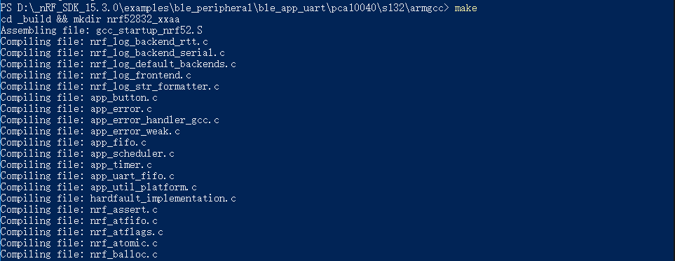
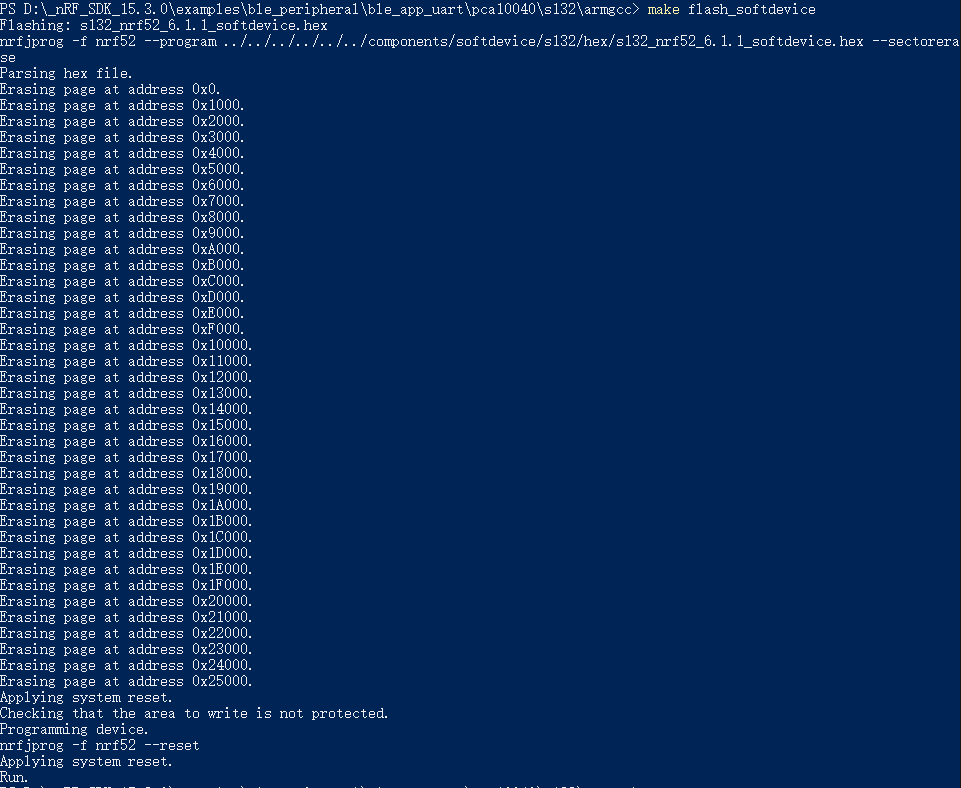
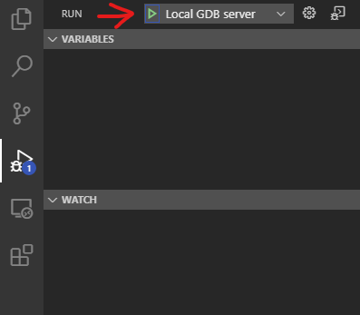

# 使用armgcc进行nRF5x的芯片开发
本文主要介绍如何搭建`nRF5x`的`armgcc`开发环境

## 物料准备

- [nRF5 SDK](https://www.nordicsemi.com/Software-and-tools/Software/nRF5-SDK)
  - 本文写作时使用的版本为`15.3`
- [nRF Command Line Tools](https://www.nordicsemi.com/Software-and-tools/Development-Tools/nRF-Command-Line-Tools/Download)
- [ARMGCC v7 2018 Q2](https://developer.arm.com/tools-and-software/open-source-software/developer-tools/gnu-toolchain/gnu-rm/downloads/7-2018-q2-update)
  - `SDK-15.3`的指定版本，根据`SDK`版本选择对应的版本
- [GNU make for windows](http://gnuwin32.sourceforge.net/packages/make.htm)
  - 本文写作时使用的版本为`3.81`
- [JLink](https://www.segger.com/downloads/jlink/#J-LinkSoftwareAndDocumentationPack)
  - 本文写作时使用的版本为v680b
- VS code 编辑器
  - `Native Debug`插件
  - 作为上面插件扩展的`Cortex debug`插件

## 步骤

1. 安装`nrf5 SDK`和`nRF Command Line Tools`
1. 安装`GNU make`
1. 安装`ARMGCC`
1. 安装`JLink`
1. 配置编辑器插件

### 安装

安装各项工具后，请将工具内可执行文件的路径添加到系统的环境变量中，以确保后续操作能够正常执行。

### 编译

完成1-3步之后，应当可以执行编译工作。可以按如下方式进行测试。

首先，打开`<SDK root>\example`目录下的一个工程，此处以`<SDK root>\examples\ble_peripheral\ble_app_uart`为例。进入`\examples\ble_peripheral\ble_app_uart\pca10040\s132\armgcc`目录，在此目录打开命令行，并执行`make`命令。



......


以上为`windows`系统上使用`powershell`正常编译的输出。

### 烧录

因为`nRF Command Line Tools`带有`nrfjprog`烧录工具，而`SDK`中的`armgcc`默认烧录方式就是使用`nrfjprog`，所以如果你正确安装了`nrfjprog`并配置好了环境变量，则此时使用`JLink`正确连接到目标板后，使用命令`make flash_softdevice`和`make flash`就可以分别烧录协议栈和应用程序了。



如图为正常烧录协议栈时的输出。

### 调试

安装完`JLink`后，在`VS Code`中安装好上述插件。

需要配置`Cortex-debug`的`armToolchainPath`和`JLinkGDBServerPath`两个属性。其中，前者是你`arm gcc`工具链的二进制文件目录，一般为`<GNU Tools ARM Embedded [version]>\bin\`，而后者是`JLinkGDBServer.exe`的路径。注意，前者是目录，而后者是可执行文件。

`armToolchainPrefix`默认为`arm-none-eabi`，一般不用修改。

接下来，使用`VS Code`打开项目文件夹，进入调试界面，新建一个配置文件，如下配置：

```
	"configurations": [
		{
			"cwd": "${workspaceRoot}",
			"executable": "./pca10040/s132/armgcc/_build/nrf52832_xxaa.out",
			"name": "Local GDB server",
			"request": "attach",
			"type": "cortex-debug",
			"servertype": "jlink",
			"gdbTarget": "127.0.0.1:2331",
			"device": "nRF52832_xxAA",
			"svdFile": "./nrf52.svd"
		}
	]
```

其中，`svd`文件为`SDK`中包含，此处已经将其拷贝到项目中。如果没有指定，则调试时无法显示内核的寄存器状态。



如果配置无误，且已经给目标板正确烧录了协议栈和应用程序，点击调试按钮即可正常进入调试。

